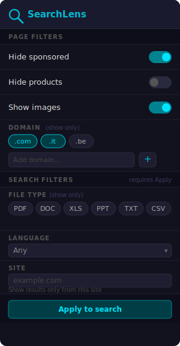
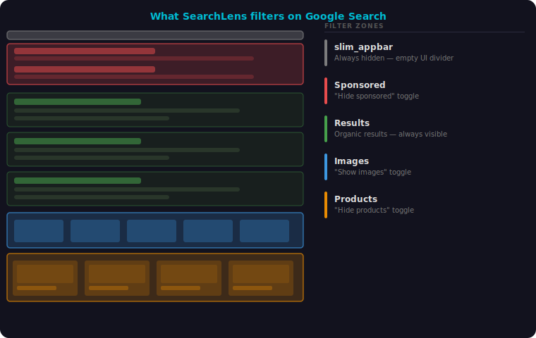

# SearchLens

> A Firefox extension that puts you in control of your search results — hide ads, products, and image carousels, or filter by file type, domain, language, and site.

<p align="center">
  
</p>

---

## Installation

SearchLens targets **Zen Browser** and Firefox forks with signature enforcement disabled — no AMO signing needed.

**Permanent install**

```bash
web-ext build
# generates web-ext-artifacts/searchlens-1.1.0.xpi
```

Install via `about:addons` → gear icon → **Install Add-on From File**.

**Development (temporary)**

`about:debugging` → **This Firefox** → **Load Temporary Add-on** → select `manifest.json`.

---

## Filters

<p align="center">
  
</p>

### Page filters — apply instantly

| Toggle | What it hides |
|---|---|
| **Hide sponsored** | Ad blocks (`#tads`, `#tadsb`) and the empty `#slim_appbar` divider |
| **Hide products** | Shopping / product carousel (`product-viewer-group`) |
| **Show images** | Image results strip (`.Lv2Cle`) |
| **Domain** | Any result not from your selected TLDs — add custom entries with the `+` input |

### Search filters — click Apply to search

These modify the Google query and reload the page.

| Filter | How it works |
|---|---|
| **File type** | Adds `filetype:pdf` (or any combo) to the query |
| **Language** | Adds `lr=lang_XX` to the URL |
| **Site** | Appends `site:example.com` to the query |

---

## How it works

The content script runs on every matching search page. On load it reads settings from `browser.storage.local` and applies DOM-based filters by toggling a `display: none` class. A debounced `MutationObserver` re-applies filters whenever Google injects content dynamically.

Search filters (language, site, filetype) skip the DOM entirely — they rewrite the search URL directly and let Google do the filtering server-side.

---

## Supported engines

Page filters work across all engines. Search filters (language, site, filetype) are Google-only.

| Engine | Sponsored | Images | Products | Domain | Search filters |
|---|---|---|---|---|---|
| Google | ✓ | ✓ | ✓ | ✓ | ✓ |
| DuckDuckGo | ✓ | ✓ | — | ✓ | — |
| Bing | ✓ | ✓ | — | ✓ | — |
| Brave Search | ✓ | — | — | ✓ | — |
| Yahoo | ✓ | — | — | ✓ | — |

---

## Development

No build step — plain JS, HTML, CSS.

```bash
git clone https://github.com/aerusW/searchlens
cd searchlens
```

Branches follow the [Praxisum-Facta git guidelines](https://github.com/GitAlexein/Praxisum-Facta/blob/alpha-development/GIT_GUIDELINES.md): all work on `feature/`, `fix/`, `style/`, `refactor/`, or `docs/` branches off `main`, merged via PR.
